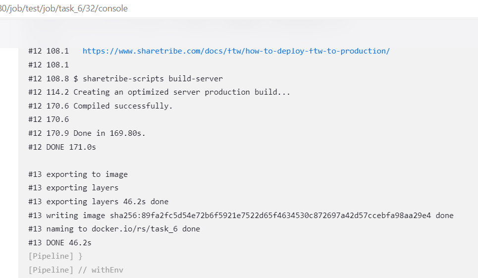
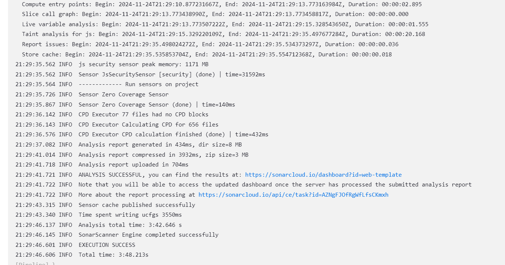

## Submission

- Provide a PR with the application, Helm chart, and Jenkinsfile in a repository.
- Ensure that the pipeline runs successfully and deploys the application to the K8s cluster.
- Provide a README file documenting the pipeline setup and deployment process.

## Evaluation Criteria (100 points for covering all criteria)

1. **Pipeline Configuration (40 points)**

   - A Jenkins pipeline is configured and stored as a Jenkinsfile in the main git repository.

     - https://github.com/CiscoSA/rs-jenkins/blob/task_6/Jenkinsfile

   - The pipeline includes the following steps:
     - Application build

       - https://github.com/CiscoSA/rs-jenkins/blob/task_6/Jenkinsfile#L55-L62

     - Unit test execution

       - https://github.com/CiscoSA/rs-jenkins/blob/task_6/Jenkinsfile#L64-L73

     - Security check with SonarQube

       - https://github.com/CiscoSA/rs-jenkins/blob/task_6/Jenkinsfile#L75-L84

     - Docker image building and pushing to ECR (manual trigger)

       - https://github.com/CiscoSA/rs-jenkins/blob/task_6/Jenkinsfile#L86-L105

     - Deployment to K8s cluster with Helm (dependent on the previous step)
     
       - https://github.com/CiscoSA/rs-jenkins/blob/task_6/Jenkinsfile#L107-L116

2. **Artifact Storage (20 points)**

   - Built artifacts (Dockerfile, Helm chart) are stored in git and ECR (Docker image).

     - https://github.com/CiscoSA/rs-jenkins/blob/task_6/Dockerfile

     

     

3. **Repository Submission (5 points)**

   - A repository is created with the application, Helm chart, and Jenkinsfile.

     - https://github.com/CiscoSA/rs-jenkins/tree/task_6

     - https://github.com/CiscoSA/rs-jenkins/tree/task_6/helm

     - https://github.com/CiscoSA/rs-jenkins/blob/task_6/Jenkinsfile

4. **Verification (5 points)**

   - The pipeline runs successfully and deploys the application to the K8s cluster.

     

     

     

     

     

     

     

     

     

5. **Additional Tasks (30 points)**
   - **Application Verification (10 points)**
     - Application verification is performed (e.g., curl main page, send requests to API, smoke test).

       - https://github.com/CiscoSA/rs-jenkins/blob/task_6/Jenkinsfile#L118-L133

       

   - **Notification System (10 points)**
     - A notification system is set up to alert on pipeline failures or successes.

       - https://github.com/CiscoSA/rs-jenkins/blob/task_6/Jenkinsfile#L138-L150

   - **Documentation (10 points)**
     - The pipeline setup and deployment process, are documented in a README file.

       - https://github.com/CiscoSA/rs-jenkins/blob/task_6/README.md
       